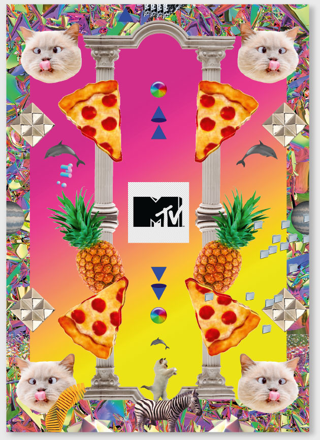
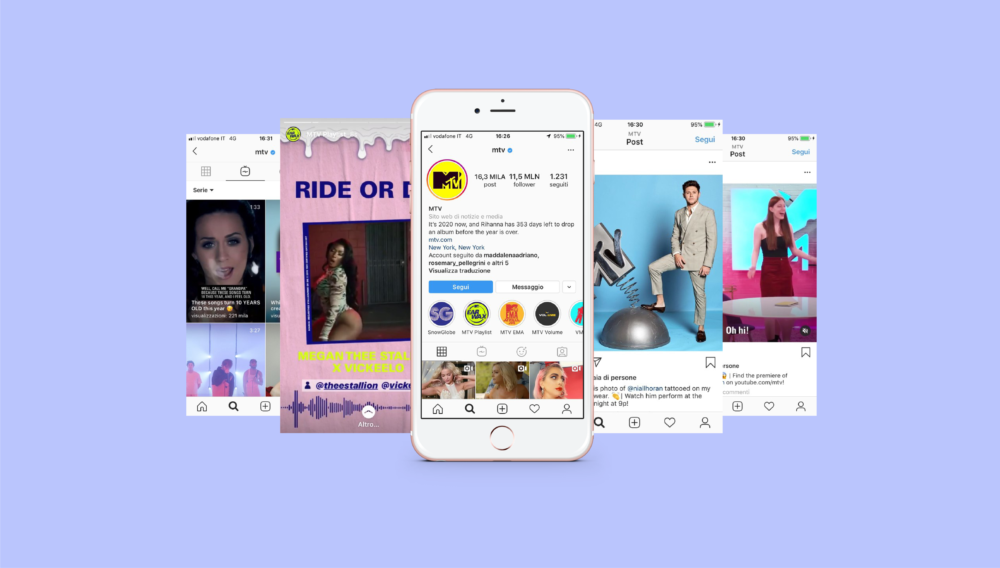

### Chi sei e di che cosa ti occupi?

Mi presento, sono Luca Dusio, mi occupo di direzione creativa e apprezzo il culto del bello.

### Come ti sei avvicinato al tuo settore e cosa ti ha spinto a intraprendere questo percorso?

Ritengo che a prescindere da quello che è stato il mio caso specifico, bisogna studiare e imparare per tutta la vita, si deve sempre alimentare la propria curiosità e questi fattori ci conducono lungo il nostro percorso. Purtroppo oggi vedo da parte dei giovani un grande disinteresse nel cercare di capire come si fanno le cose in generale, nonostante sul web ci siano una quantità enorme di informazioni accessibili a chiunque e pensare che una volta per studiare il funzionamento dei programmi si dovevano acquistare dei manuali enormi. Noto che lo spirito di sacrificio, la voglia di fare e la curiosità stanno calando sempre di più ma soprattutto oggi che i trend continuano a cambiare si deve essere sempre aggiornati altrimenti non si può stare al passo con i tempi. Ho scoperto che dei compagni di università che si erano laureati con me ad oggi solo il 10-15% lavora ancora in questo settore e i creativi che ci lavorano dicono di farlo per il proprio ego ma bisogna farlo per gli altri, non per se stessi.

### Cosa significa progettare per la televisione oggi? Come si può colmare il divario che si è creato tra la televisione e i new media?

Ricordo che quando sono andato nel 2009 a MTV mi dicevano che l’unica regola era progettare cose belle e sensazionali, ovviamente era una affermazione molto relativa. Nel 2015 per cercare di rinnovarsi hanno stravolto i canoni e hanno creato una nuova immagine visiva chiamata Kill Boring piena di emoticon, il risultato è stato un disastro e io mi trovavo molto in difficoltà a lavorare in questo contesto concettuale, poi nel giro di poco tempo per fortuna questo tipo di trend è stato abbandonato completamente.

### Che peso e che ruolo deve avere la pianificazione in un progetto?

Nel corso degli anni questo aspetto è cambiato molto, quando ho iniziato a lavorare per MTV il formato standard ad esempio era il PAL che consiste in 720 pixel in altezza per 576 in larghezza, c’erano ancora molti televisiori a tubo catodico e mia madre per visionare la programmazione tv consultava le riviste televise. Oggi ormai è cambiato tutto e il focus principale si è spostato nel mondo del digitale e credo che ci sia una sovrapproduzione che ha determinato un impoverimento dei contenuti nella maggior parte dei casi. Questo fenomeno porta inevitabilmente anche a diluire le proprie risorse sia dal lato economico ma anche per quanto riguarda le energie spese dai team di lavoro.

### Quali sono le difficoltà che si incontrano quando si lavora per un player importante come MTV?

I nostri superiori dicevano costantemente che dovevamo essere presenti e attivi sui social, ma la vera domanda era come dovevamo mostrarci sui social e cosa trasmettere. Lavoravamo a 360 gradi e di conseguenza progettavamo anche per l’ambito digital, ma c’era già un altro team per questo settore e a volte era difficile coordinare sempre tutte le parti coinvolte. Per questo creavamo un toolkit di base che potesse essere adattato a tutti gli utilizzi, per i social, per la televisione e anche per il cartaceo. Un tempo a livello europeo l’evento più importante per MTV erano gli European Music Awards e per realizzare la sigla veniva stanziato un budjet importante, oggi non ha più senso spendere cifre elevate in artefatti che vengono visionati dal pubblico una sola volta. Nel mondo televisivo è in atto una guerra e resteranno nel settore solo i player più grandi, per questo motivo oggi si tende a spostare i budjet altrove, ad esempio sulle piattaforme.

### Come mantenere una identità forte?

La creatività sta passando in secondo piano per lasciare più spazio alle strategie di marketing ma i numeri non sono tutto e per mantenere forte l’identità del proprio brand la parte emozionale è fondamentale. Alcune aziende oggi hanno perso di vista questo aspetto mentre altre ne hanno fatto il proprio pilastro fondante e le differenze di andamento sul mercato si possono notare chiaramente. Un brand deve essere anche molto recettivo, catturare gli stimoli esterni e cercare di imbracciarli sempre coordinandoli al proprio sistema di valori.

### Come raggiungere i target più giovani?

Quando si progettano i cartoni animati per i bambini bisogna sempre tenere in considerazione i genitori che sono un elemento molto importante, questo perchè sono i genitori stessi che decidono quali cartoni animati far vedere ai propri figli o meno.

### Hai riscontrato differenze sostanziali tra l’Italia e gli altri paesi in cui hai lavorato?

Qui in Italia un classico è quando si consegna al cliente un progetto di venerdì e subito ti vengono richieste delle modifiche e ti vengono concessi magari due o tre giorni e il week end ne fa parte, mentre all’estero il week end è sempre considerato di riposo e le tempistiche di consegna vengono ragionate di conseguenza. Qui in Italia inoltre abbiamo certamente una marcia in più ma il nostro problema è che nella maggior parte dei casi ognuno lavora per conto suo e a causa dei troppi protagonismi è difficile fare gruppo. Una pecca per noi italiani all’estero è che ci sono molti pregiudizi nei nostri confronti e a volte è difficile farsi valere nei team di lavoro.
