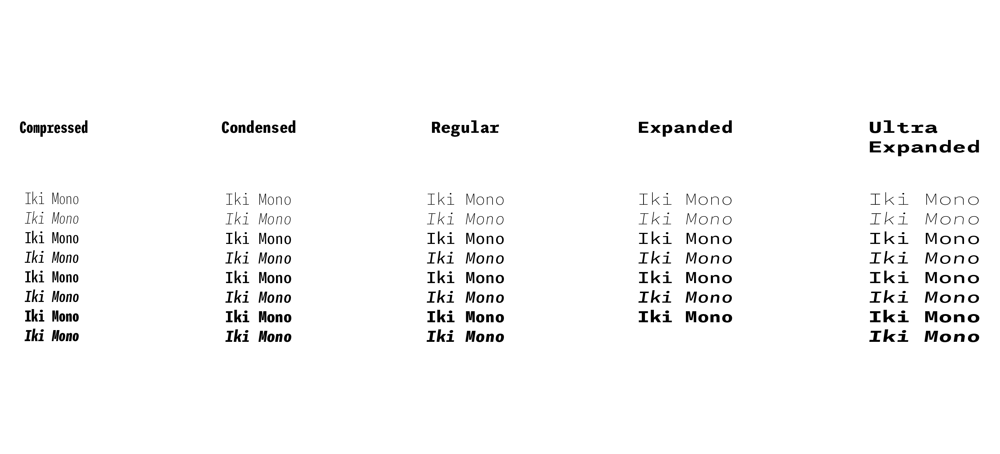
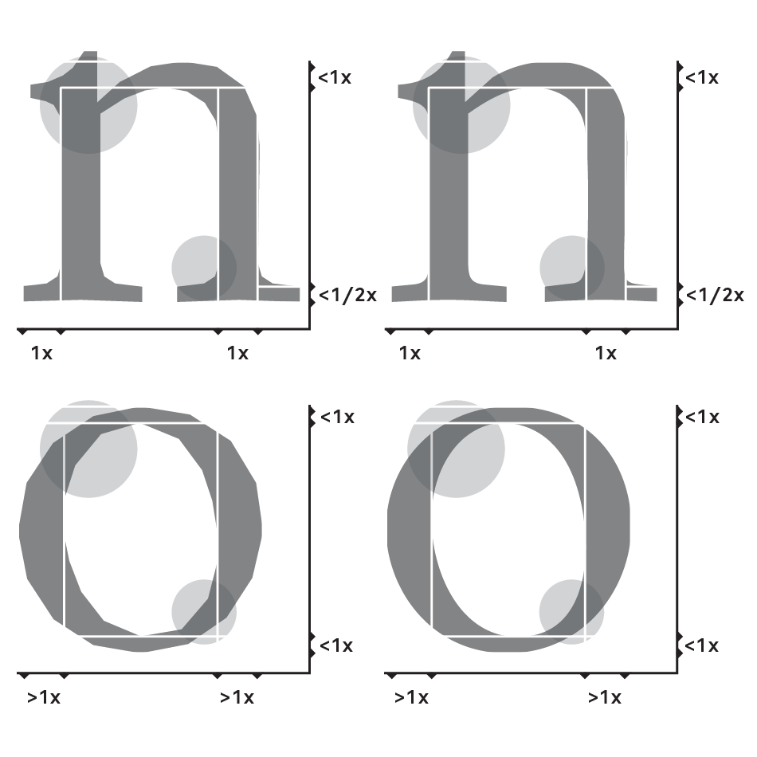

### Ciao Beatrice, chi sei e di cosa ti occupi?

Sono una grafica e type designer, principalmente mi occupo quindi di progettare i caratteri.  
Lavoro per lo studio LeftLoft e in particolare curo l’aspetto tipografico dei progetti. Quando ad esempio in un progetto di branding si deve realizzare un alfabeto ad hoc o un logotipo chiamano me; aiuto anche in generale nella scelta dei font per i vari progetti.  
Mi occupo anche dell’insegnamento della materia e a breve uscirà un carattere disegnato da me, è il primo progetto personale così importante e sto collaborando con type together che è la fonderia che pubblica i caratteri realizzati a LeftLoft.

### Come ti sei avvicinata al type design?

Durante l'esperienza universitaria non mi sono mai interessata molto a questa materia, ho frequentato durante la triennale la facoltà di moda e mi sono occupata più della parte grafica. Quando poi ho intrapreso il percorso in Design della Comunicazione la tipografia mi ha subito affascinata ma la ritenevo molto difficile, infatti l’amore per il type design è nato in un secondo momento durante il tirocinio a Berlino in uno studio tedesco.  
Mi è piaciuta da subito l’idea di lavorare su qualcosa in cui i dettagli sono molto importanti ma al tempo stesso quasi impercettibili, infatti quando osservi un alfabeto o un paragrafo realizzato con un determinato carattere, non vedi i dettagli delle singole lettere ma ciò che sono in grado di restituirti nel loro insieme, questa è la magia del type design.

### Come hai vissuto il passaggio da moda a comunicazione?

Prima di tutto devo dire che è stato un trauma passare da un liceo alla facoltà di Design della Moda, perché venivo da un ambiente in cui ero abituata ad avere semplicemente dei libri su cui studiare, dopo invece mi sono ritrovata a dover sviluppare un pensiero progettuale e affrontare lavori di gruppo.  
Al terzo anno durante il corso di sintesi mi sono occupata di un progetto di branding e questa è stata la svolta, perché ho seguito tutto con particolare cura e il docente mi ha fatto notare la mia spiccata sensibilità grafica.
Ho deciso poi che sarei passata a Comunicazione perché mi piaceva l’idea di fare branding e trattare anche gli artefatti stampati, in un primo momento non avevo scelto subito questo corso perché non capivo molto bene di che cosa potesse trattare nello specifico.

### Come giudicheresti la situazione del type design in Italia?

In Italia ci sono stati tempi d’oro per la tipografia risalenti ad esempio a Manuzio, però poi dopo Novarese questo ambito si è un pò spento e siamo in pochi ora rispetto a prima. Quando sono rientrata da Berlino infatti è piaciuta subito la preparazione che racchiudeva conoscenze di type design e ho trovato il mio spazio qui a Milano.

### Cosa dovremmo fare per rimanere al passo?

Voglio premettere che il Politecnico di Milano è una ottima università che ti prepara a livello progettuale, ti fornisce un metodo che può poi essere impiegato in qualsiasi cosa.  
Tratta nel caso di Design della Comunicazione di un pò tutti gli argomenti del settore ma credo che per rimanere al passo si debba dare più spazio alla tipografia che è importantissima per qualsiasi progetto.  
Attualmente stiamo cercando di muovere le acque, infatti c’è una conferenza chiamata (Atifi) dedicata alla tipografia che si svolge una volta all’anno in città del mondo sempre differenti, e la nostra intenzione è quella di candidare la città di Milano per ospitare l’edizione dell’anno prossimo.

### A tuo avviso servono più type designer? Che consigli puoi dare in generale a uno studente di comunicazione?

Sostenere almeno un corso legato alla tipografia è sicuramente molto utile, ma non consiglio a tutti di specializzarsi in questo ambito specifico perché ci vuole molta pazienza e perseveranza per intraprendere questo percorso.
